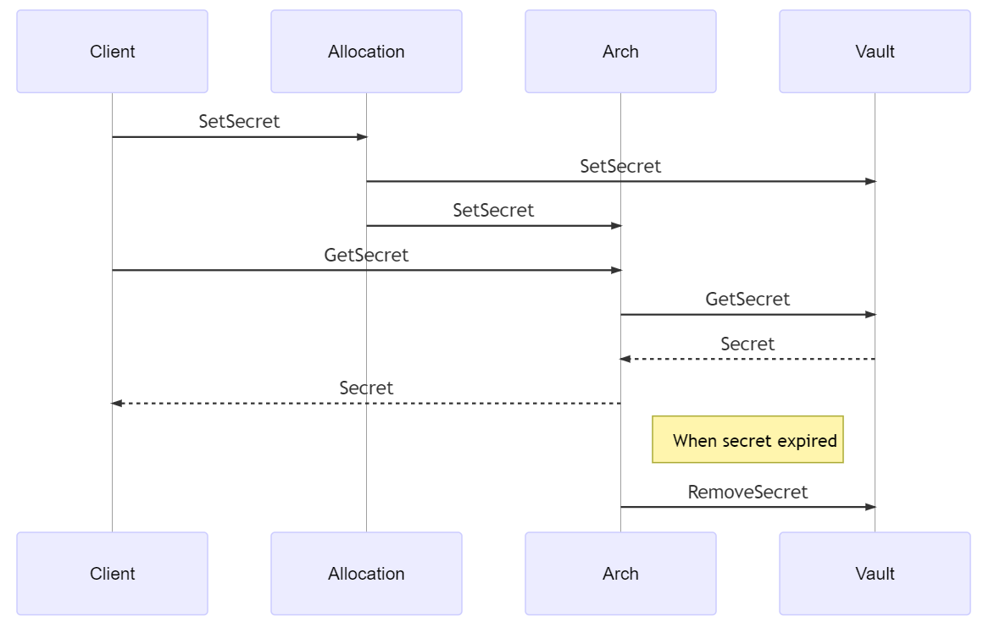
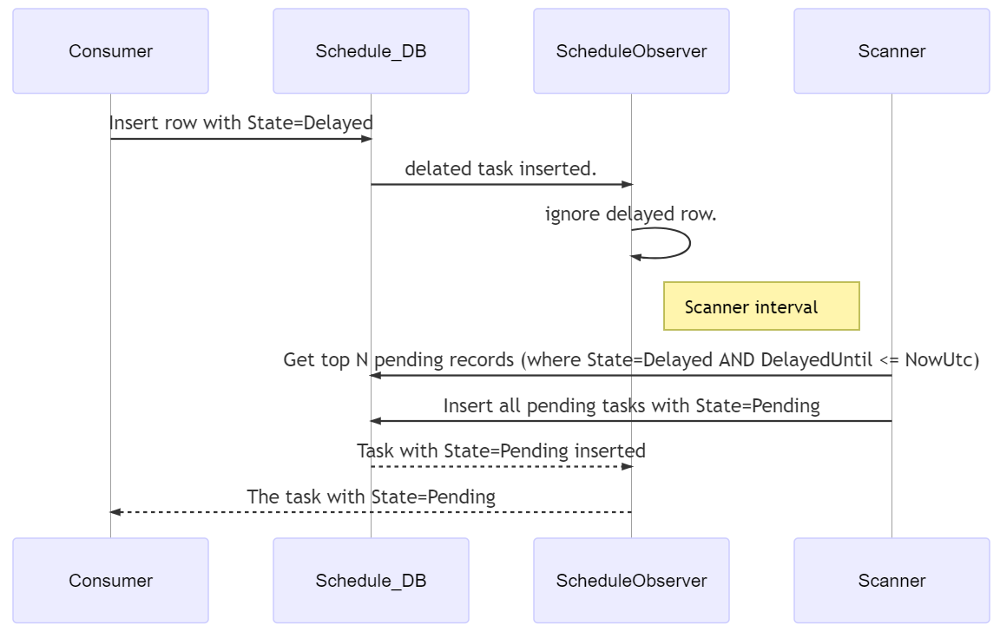
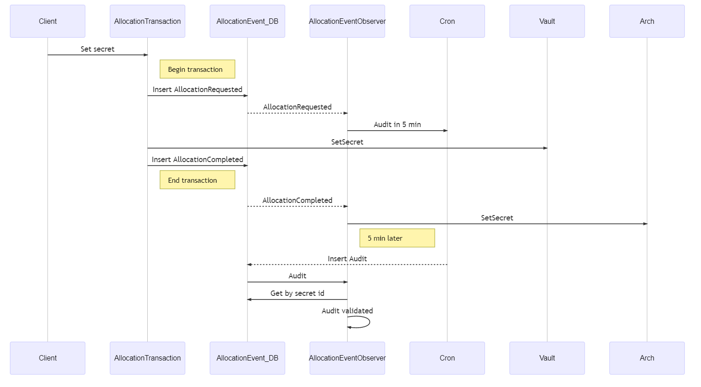
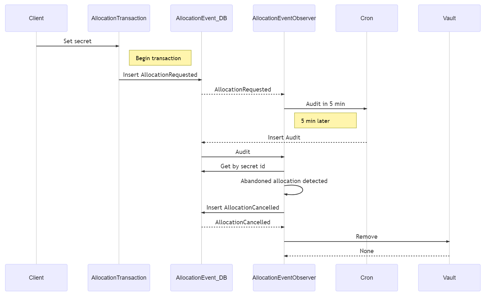
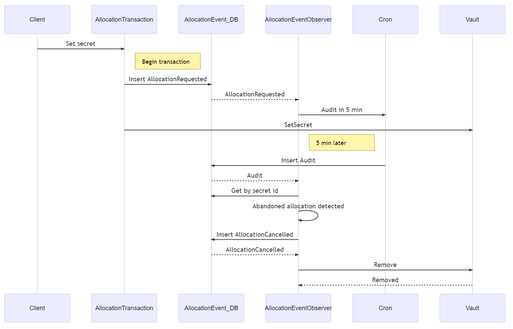
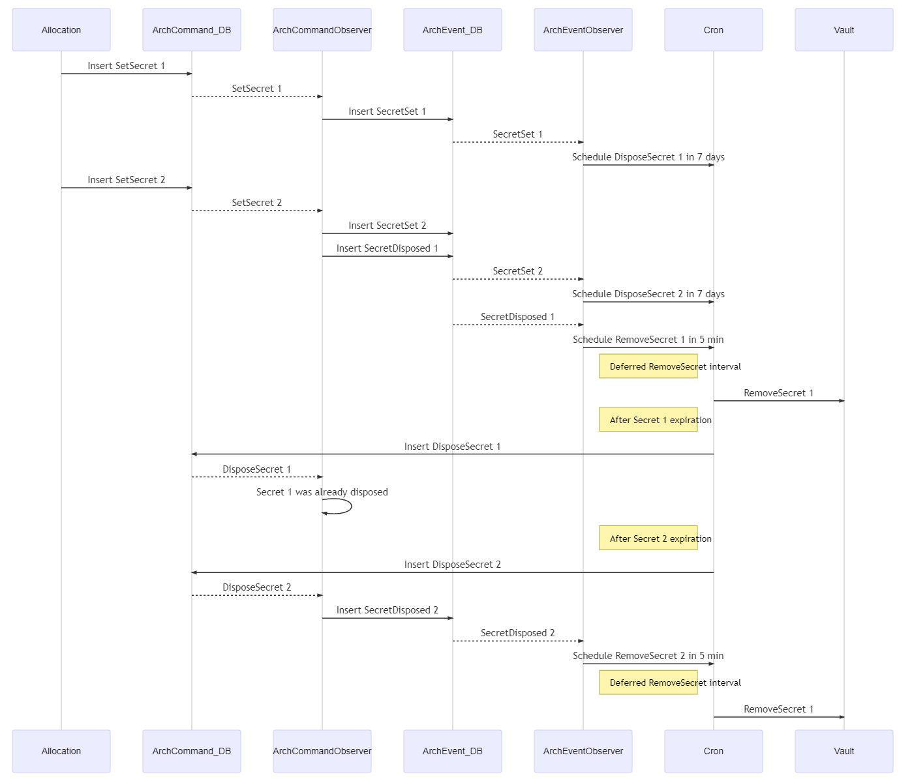

# Secret Arch - advanced secret lifecycle management

Azure KeyVault is a service provided by Azure for securely storing secrets. Imagine a scenario where we need to remove secrets post-expiration, a feature that KeyVault does not offer. Designing a KeyVault decorator service that supplements these missing features would be highly beneficial. Let's even think about solution that will allow to manage secret lifetime. I called such concept as Secret Arch. 
KeyVault or other secret vault capabilities may be extended by secret managing service that will provide additional lifetime features.
This document contains concept of Managed Secret that is kind of service that extends basic abstract 
## Secret Vault features:

1. Secrets may be reset to new value.
1. Secrets may expire after some period and must be removed.
1. All operations should be transactional and provide eventual consistency of all aggregates. 
1. SLA near to CosmosDb which is P99.
1. Underlying Secret Vault is abstract storage with limited API just to setSecret, getSecret, removeSecret. Other alternatives to KeyVault may be used.

## Concepts

- Allocation is double phase commit process of insert secret into DB and SecretVault.
- Arch is managed secret entity that is guarantee consistency of set, get, renew and remove operations.

## Cron
Chron provides deferred operations. Analog or Azure ServiceBuss deferred message but build using CosmosDB change feed. It can be implemented as No-SQL change feed.
Chron is internal mechanism that is not visible for client but is used by Allocation, Arch and deallocation services.

- Consumer - procedure that requests some task to be scheduled
- Schedule_DB - No-SQL collection with change feed.
- ScheduleObserver - Schedule_DB change feed listening procedure.
- Scanner - Infinite loop procedure, preferably single instance with [leader election](https://docs.microsoft.com/en-us/azure/architecture/patterns/leader-election) that query Schedule_DB to filter active records.

# Allocation transaction

Secret Allocation is analog of KeyVault set but just should have transactional SecretVault and No-SQL registry update.

## Samples of non-transactional operations between SecretVault and No-SQL Registry.

#### Case 1: SecretVault first and Database second.
Let's consider case when we insert to SecretVault first and to database Registry second. If first SecretVault was successful and second operation failed then secret may be abandoned in Secret Vault. Second operation may fail by many reasons as process failure or, which is more probable, No-SQL database connectivity issue.

### Case 2: Database first and SecretVault second.
Let's consider case when we insert to Database first and to SecretVault second. If first operation was successful and second operation failed then database record will be inconsistent. Second operation may fail by many reasons as process failure or, which is more probable, SecretVault connectivity issue.

### Case 3: Two phase commit.
We may set a secret in tree phases.
1. Insert Database secret set initialization. That operation should schedule transaction consistency audit operation. Consistency Audit operation may be executed in few minutes after initialization phase.
2. Set Secret Vault. 
3. Insert Database secret commit.
Consistency audit should remove SecretVault item if it was not committed in database.

## Legacy secrets pruning.
To remove all legacy secrets it is possible to register then for removing using tha same engine that is used in two phase commit. Any secret that had only first phase DB record and don't have second phase record will be automatically removed after few minutes. See Allocation transaction rollback in this document.

## Allocation two phase transaction Committed - AllocationRequested, keyVaultSet and AllocationCompleted completed.

## Allocation transaction rollback - AllocationRequested but no progress anymore.

## Allocation transaction rollback - AllocationRequested, keyVaultSet but no completion.

## Arch
Arch is managed secret entity that is guarantee consistency of set, get, renew and remove operations. Note that Arch service doesn't update Vault itself. If command comes from Allocation to Arch that means that secret is already stored in Vault. When arch decides that secret can be deallocated it calls Deallocation service to defer secret removal. It will provide secret read consistency because if secret in arch is marked as actual then Vault secret will be available for read from Vault at least for few minutes.

