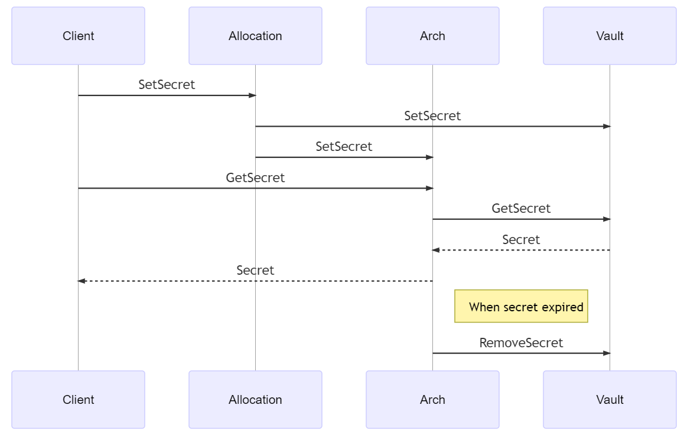
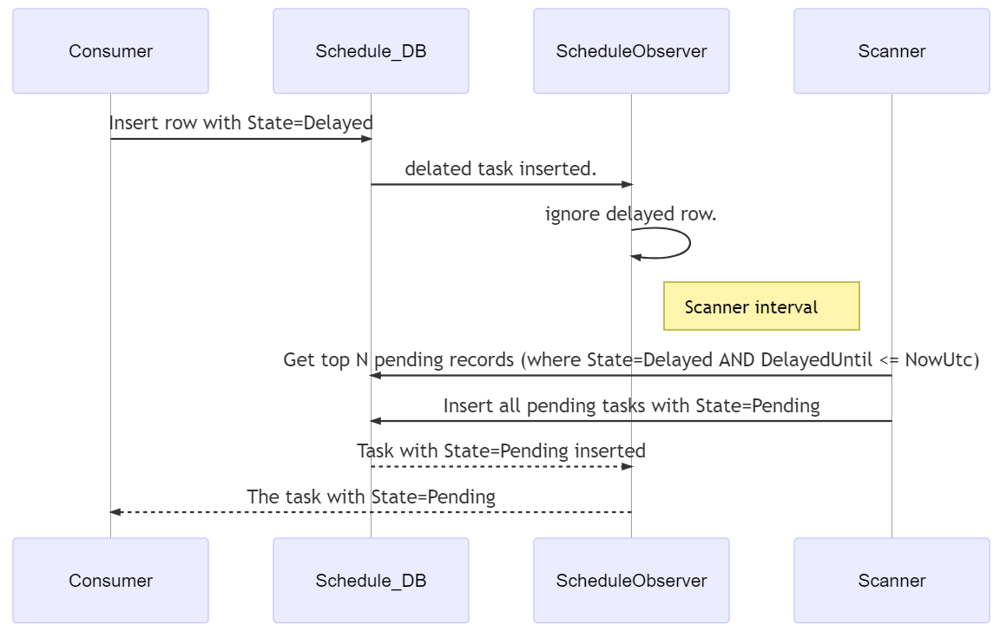
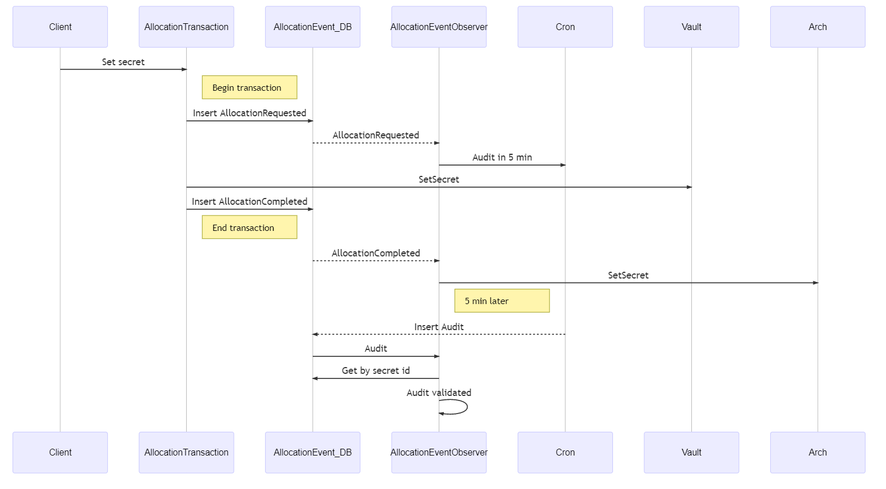
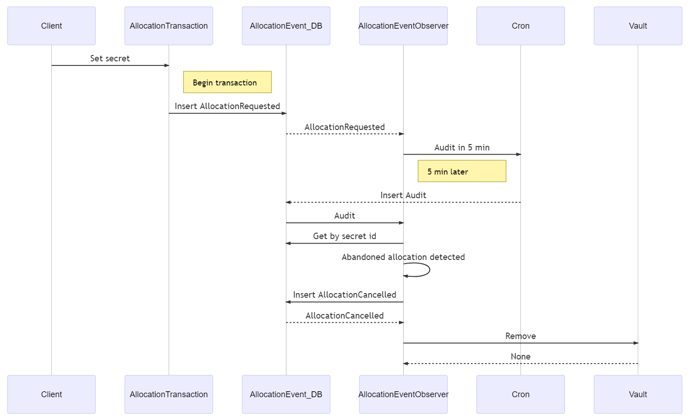
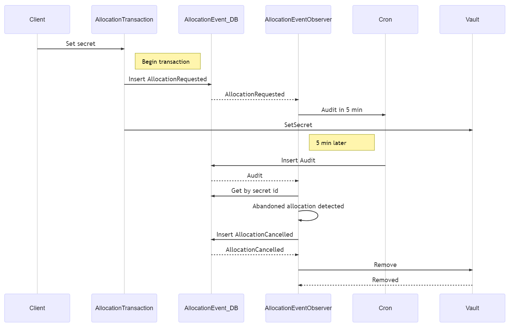
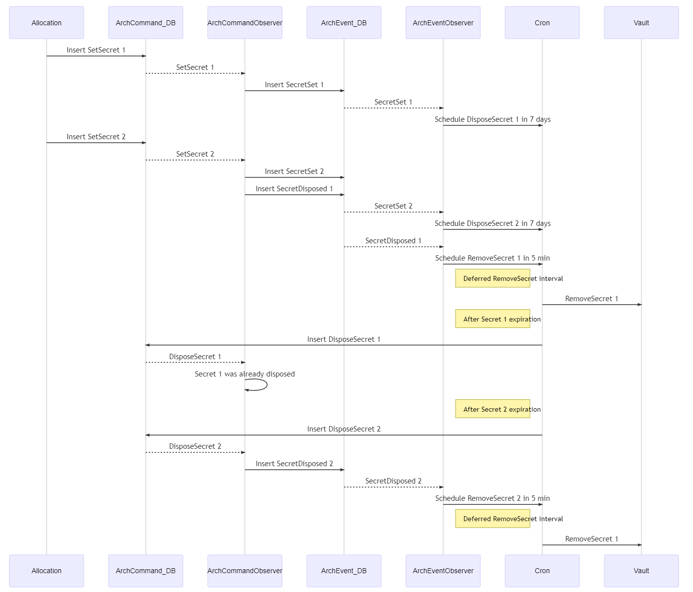

# Secret Arch - advanced secret lifecycle management

Azure Key Vault is a service provided by Azure for securely storing secrets. Imagine a scenario where we need to remove secrets after expiration, a feature that Key Vault does not offer. Designing a Key Vault decorator service that supplements these missing features would be highly beneficial. Let’s think about a solution that will allow us to manage secret lifetime. I call that concept Secret Arch.
Key Vault or other secret vault capabilities may be extended by a secret management service that will provide additional lifetime features.
This document contains the concept of Managed Secret, which is a service that extends a basic abstract
## Secret Vault features:

1. Secrets may be reset to new value.
1. Secrets may expire after some period and must be removed.
1. All operations should be transactional and provide eventual consistency of all aggregates. 
1. SLA near to CosmosDb which is P99.
1. Underlying Secret Vault is abstract storage with limited API just to setSecret, getSecret, removeSecret. Other alternatives to KeyVault may be used.

## Concepts

- Allocation is a two-phase commit process of inserting a secret into DB and SecretVault.
- Arch is a managed secret entity that guarantees consistency of set, get, renew, and remove operations.

## Cron
Chron provides deferred operations, like Azure Service Bus deferred messages, but built using Cosmos DB change feed. It can be implemented as a NoSQL change feed.
Chron is an internal mechanism that is not visible to the client but is used by Allocation, Arch, and deallocation services.

- Consumer - procedure that requests some task to be scheduled
- Schedule_DB - NoSQL collection with change feed.
- ScheduleObserver - Schedule_DB change feed listening procedure.
- Scanner - Infinite loop procedure, preferably a single instance with [leader election](https://docs.microsoft.com/en-us/azure/architecture/patterns/leader-election) that queries Schedule_DB to filter active records.

# Allocation transaction

Secret Allocation is analogous to Key Vault set, but it should have a transactional SecretVault and NoSQL registry update.

## Samples of non-transactional operations between SecretVault and No-SQL Registry.

#### Case 1: SecretVault first and Database second.
Let's consider the case when we insert to SecretVault first and to the database Registry second. If the first SecretVault operation was successful and the second operation failed, then the secret may be abandoned in Secret Vault. The second operation may fail for many reasons, such as a process failure or, more likely, a NoSQL database connectivity issue.

### Case 2: Database first and SecretVault second.
Let's consider the case when we insert to Database first and to SecretVault second. If the first operation was successful and the second operation failed, then the database record will be inconsistent. The second operation may fail for many reasons, such as a process failure or, more likely, a SecretVault connectivity issue.

### Case 3: Two phase commit.
We may set a secret in three phases.
1. Insert Database secret set initialization. That operation should schedule a transaction consistency audit operation. The consistency audit operation may be executed a few minutes after the initialization phase.
2. Set Secret Vault. 
3. Insert Database secret commit.
The consistency audit should remove the SecretVault item if it was not committed in the database.

## Legacy secrets pruning.
To remove all legacy secrets it is possible to register them for removal using the same engine that is used in the two-phase commit. Any secret that had only the first-phase DB record and does not have the second-phase record will be automatically removed after a few minutes. See Allocation transaction rollback in this document.

## Allocation two phase transaction Committed - AllocationRequested, keyVaultSet and AllocationCompleted completed.

## Allocation transaction rollback - AllocationRequested but no progress anymore.

## Allocation transaction rollback - AllocationRequested, keyVaultSet but no completion.

## Arch
Arch is a managed secret entity that guarantees consistency of set, get, renew, and remove operations. Note that Arch service does not update Vault itself. If a command comes from Allocation to Arch, that means the secret is already stored in Vault. When Arch decides that the secret can be deallocated, it calls the Deallocation service to defer secret removal. It provides secret read consistency because if a secret in Arch is marked as actual, then the Vault secret will be available for read from Vault for at least a few minutes.

