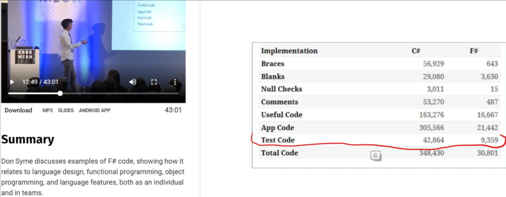

# Lazy Load with Expiration - C# Chainsaw vs F# Light Saber

.NET has [Lazy class](https://docs.microsoft.com/en-us/dotnet/api/system.lazy-1?view=net-5.0) .
F# has [Lazy Expression](https://docs.microsoft.com/en-us/dotnet/fsharp/language-reference/lazy-expressions).
Had tried to create Lazy load of some object with expiration (e.g. configuration with refresh timeout).
Implementation had to have following features:
1. Be fully testable. Only pure functions may be tested properly because they have fully deterministic behavior.
2. Be thread-safe.

Initially I was thinking about C# class. Note that C# code in this article may contains only class signature with method's logic ommited.

```C#
public class LazyExpirable<TValue> {
  public LazyExpirable(Func<TValue> getValue, TimeSpan timeSpan);
  public TValue GetValue();
}
```
Such C# class will not be testable because somewhere inside of `GetValue()` method we will need to call `System.DateTime.UtcNow` that makes our logic not pure and not testable.
To solve this in OOP paradigm we need to use [Dependency Injection](https://www.goodreads.com/book/show/9407722-dependency-injection-in-net).
We need to create interface that will let to get current time. Also we will have to update our LazyExpirable class signature.
Also we need to create a factory class may be used with [Dependency Injection Container](https://docs.microsoft.com/en-us/dotnet/core/extensions/dependency-injection).
```C#
/// This interface may be injected everywhere where UTC time may be requested.
public interface IDateTimeProvider {
  DateTime GetUtcNow();
}
public sealed class DateTimeProvider: IDateTimeProvider {
  public DateTime GetUtcNow() => DateTime.UtcNow;
}
/// Will be created inside of the factory .
public class LazyExpirable<TValue> {
  public LazyExpirable(Func<TValue> getValue, TimeSpan timeSpan, IDateTimeProvider dateTimeProvider);
  public TValue GetValue();
}
/// Factory class may be used with Dependency Injection Container.
public class LazyExpirableFactory {
  private readonly IDateTimeProvider dateTimeProvider;
  public LazyExpirableFactory(IDateTimeProvider dateTimeProvider){
    this.dateTimeProvider = dateTimeProvider;
  }
  public LazyExpirable<TValue> NewLazyExpirable<TValue>(Func<TValue> getValue, DateTime expireOn) =>
    new LazyExpirable(getValue, expireOn, this.dateTimeProvider);
}
```
But what if lifecycle will be not just time span between DateTome.UtcNow snapshots? It would be great to have more generic way to define lifecycle. Let's define lifecycle as some object that defines if value is steal alive. Value will be created with lifecycle.
```C#
public interface IDateTimeProvider {
  DateTime GetUtcNow();
}
public interface ILifecycle {
  bool IsAlive();
}
public sealed class LifecycleByTime: ILifecycle {
  // Dependency Injection
  private readonly IDateTimeProvider dateTimeProvider;
  // Initial state.
  private readonly DateTime createdAt;
  // Lifetyme patameter.
  private readonly TimeSpan timeSpan;
  public LifecycleByTime(IDateTimeProvider dateTimeProvider, TimeSpan timeSpan){
    this.dateTimeProvider = dateTimeProvider;
    this.timeSpan = timeSpan;
    this.createdAt = dateTimeProvider.GetUtcNow();
  }
  // Is alive when not expired.
  public bool IsAlive() => this.createdAt + this.timeSpan > this.dateTimeProvider.GetUtcNow();
}
// We need factory for Dependency Injection.
public sealed class LifecycleByTimeFactory {
  // Dependency injection
  private readonly IDateTimeProvider dateTimeProvider;
  public LifecycleByTimeFactory(IDateTimeProvider dateTimeProvider){
    this.dateTimeProvider = dateTimeProvider;
  }
  public ILifecycle NewLifecycle(TimeSpan timeSpan) => new LifecycleByTime(this.dateTimeProvider, timeSpan); 
}
/// Aggrigates values and its lifecycle.
public class ValueWithLifecycle<TValue>{
  public ValueWithLifecycle(TValue value, ILifecycle lifecycle);
  public TValue Value { get; } 
  public ILifecycle Lifecycle { get; }
}
// Now Lazy may be activated with generic lifecycle.
public class LazyWithLifecycle<TValue> {
  private readonly Func<ValueWithLifecycle<TValue>> getValueWithLifecycle;
  private Lazy<ValueWithLifecycle<TValue>> state;
  public LazyExpirable(Func<ValueWithLifecycle<TValue>> getValueWithLifecycle){
    this.getValueWithLifecycle = getValueWithLifecycle;
    this.state = new Lazy<ValueWithLifecycle<TValue>>(getValueWithLifecycle);
  }
  /// Gets value using lazy loaded value and lifecycle.
  public TValue GetValue(){
    var stateCopy = this.state.Value;
    if (state.Lifecycle.IsAlive()) {
      return stateCopy.Value;
    }
    else {
      let newState = new Lazy<ValueWithLifecycle<TValue>>(getValueWithLifecycle);
      this.state = newState;
      return newState.Value.Value;
    }
  }
}
/// Factory class may be used with Dependency Injection Container.
public class LazyExpirableFactory {
  private readonly LifecycleByTimeFactory lifecycleByTimeFactory;
  public LazyExpirableFactory(LifecycleByTimeFactory lifecycleByTimeFactory){
    this.lifecycleByTimeFactory = lifecycleByTimeFactory;
  }
  private ValueWithLifecycle<TValue> NewValueWithLifecycle<TValue>(Func<TValue> getValue, TimeSpan timeSpan) => 
    new ValueWithLifecycle(getValue, lifecycleByTimeFactory.NewLifecycle(timeSpan));
  
  public LazyExpirable<TValue> NewLazyExpirable<TValue>(Func<TValue> getValue, DateTime expireOn) =>
    new LazyWithLifecycle(NewValueWithLifecycle);
}
```
Yes, this is now SOLID OOP may look like.

Now let's look at axactly the same logic using F#. F# support .NET OOP Dependency Injection but we may compose our logic using more functional technique called [Dependency Rejection](https://blog.ploeh.dk/2017/02/02/dependency-rejection/).
```F#
let lazyWithLifecycle getValueWithLifecycle =
    let mutable state = lazy(getValueWithLifecycle())
    fun () ->
        let value, isLive = state.Force()
        if isLive() then value
        else
            let newState = lazy(getValueWithLifecycle())
            state <- newState
            newState.Force() |> fst
let newTimeSpanLifecyle(timeSpan: TimeSpan) =
    let createdAt = DateTime.UtcNow
    fun () -> createdAt + timeSpan > DateTime.UtcNow
let lazyTemp get timeSpan = 
    lazyWithLifecycle (fun () -> get(), newTimeSpanLifecyle(timeSpan))
```
`lazyWithLifecycle` function is testable because it takes only `getValueWithLifecycle` argument that is function that returns value and lifecycle.
Let's consider more verbose syntax for F# beginners who are not familiar with F# type inference.
```F#
// Function that returns bool.
type Lifecycle = unit -> bool
// Tuple of generic value and lifecycle.
type ValueWithLifecycle<'TValue> = 'TValue * Lifecycle
// Function that returns tuple of generic value and lifecycle.
type GetValueWithLifecycle<'TValue> = unit -> ValueWithLifecycle<'TValue>
// Result function that returns generic value.
type LazyGetterResult<'TValue> = unit -> 'TValue
let lazyWithLifecycle<'TValue>(getValueWithLifecycle: GetValueWithLifecycle<'TValue>): LazyGetterResult<'TValue>  =
    let newStateLazy () = 
    let mutable state: Lazy<ValueWithLifecycle<'TValue>> = newStateLazy()
    fun () ->
        let (value: 'TValue, isLive: Lifecycle) = state.Force()
        if isLive() then value
        else
            let newState = newStateLazy()
            state <- newState
            let (valueNew: 'TValue, _) = newState.Force()
            valueNew
```
Now let's write test for `lazyWithLifecycle` function. 
```F#
module LazyTemporaryTest

open LazyWithLifecyle
open Xunit

type LazyTempPureState<'v> = 
    | GetValueWithLifecycle of value: 'v
    | Lifecyle of result: bool
    | ResultTest of value: 'v

[<Fact>]
let ``Test Lazy Temp as steps script`` () =  
    
    // List of steps that are function calls 
    let mutable testScript = [
        // Return value and with long lifecycle
        GetValueWithLifecycle 1
        Lifecyle true
        ResultTest 1
        Lifecyle true
        ResultTest 1
        Lifecyle true
        ResultTest 1
        
        // Initial lifecycle end and new lifecycle begin
        Lifecyle false
        GetValueWithLifecycle 2
        ResultTest 2
        Lifecyle true
        ResultTest 2

        // New lifecycle once again
        Lifecyle false
        GetValueWithLifecycle 3
        ResultTest 3
    ]

    // gets next step from script list
    let getScriptStep () =
        match testScript with
        | [] -> failwith "Any step expected."
        | head::tail -> 
            // Remove list head from script
            testScript <- tail
            head

    let hasScriptSteps() = testScript <> []

    // Lifecycle function call that tests that head script step is expected lifecycle test
    let lifecycle () =
        match getScriptStep() with
        | Lifecyle l -> l
        | _ -> failwith "Lifecyle expected."

    // LazyTemp function call that tests creation of new value with lifecycle
    let getValueWithLifecycle () =
        match getScriptStep() with
        | GetValueWithLifecycle v -> v, lifecycle
        | _ -> failwith "CallGetValue expected."

    // construct lazy temp value
    let valueLazyTemp = lazyWithLifecycle getValueWithLifecycle

    // test to the end of the script
    while hasScriptSteps() do
        let resuldActual = valueLazyTemp()
        match getScriptStep() with
        | ResultTest re ->  Assert.True((resuldActual = re))
        | _ -> failwith "ResultTest expected."

```
You may note that C# OOP SOLID decomposition takes about 100+ lines of code. F# functional takes less than 20 lines of code. 
F# is not always much shorter than C#. I was collecting different statistics from many successful companies and found that functional F# is about 5+ times smaller than C# OOP. 
Here is one of statistics provided by [Don Syme](https://en.wikipedia.org/wiki/Don_Syme).

Last 15 years C# evolves by providing elements of functional programming which is great. However it makes C# look like Chainsaw in comparison to F# Light Saber (see [the adult meme on redit](https://www.reddit.com/r/fsharp/comments/gonlnb/f_5_vs_c_9_nsft/) about it). This is the explanation why F# has not become the mainstream.
