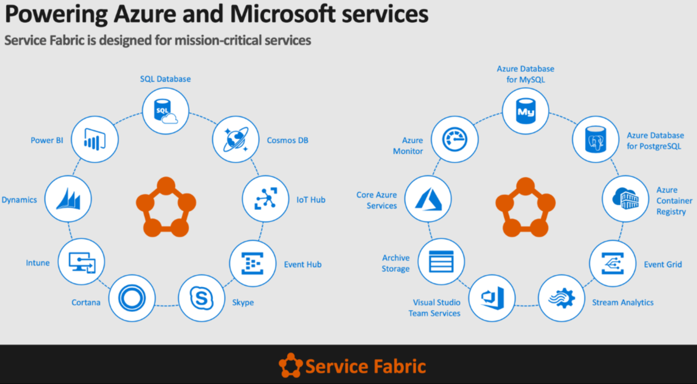
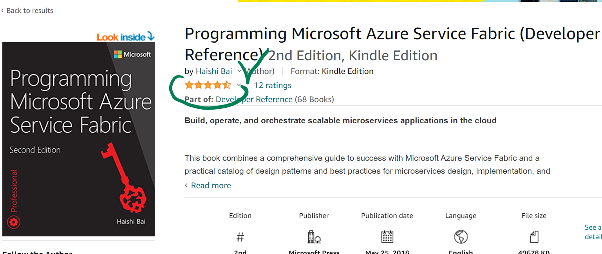
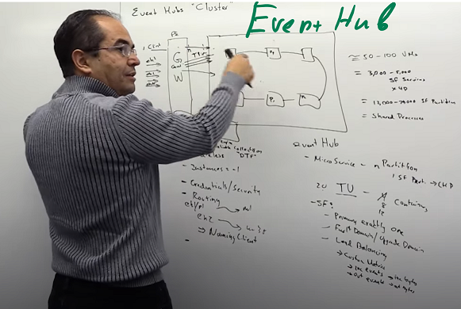
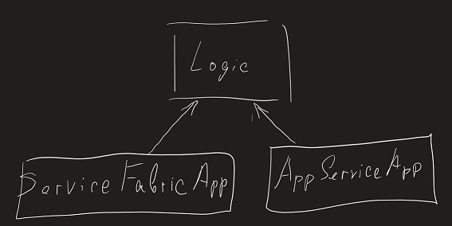
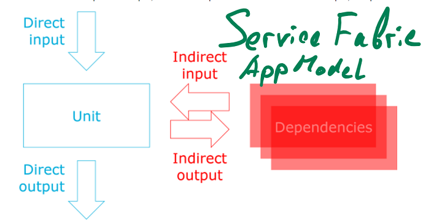

# From Service Fabric to App Service 

Service Fabric is a very powerful PaaS that is the foundation for many fundamental services in Azure and beyond. However, there are some concerns with the maintenance and general development experience when Service Fabric is chosen as the framework as the time spent in dealing with the framework might outweigh the time dedicated to the app development. For that reason, I decided to migrate our PaaS service from Service Fabric to App Service. This document contains retrospective of challenges that I have encountered during that process. 

- [From Service Fabric to App Service](#from-service-fabric-to-app-service)
  - [Why migrate from Service Fabric](#why-migrate-from-service-fabric)
    - [My Service Fabric learning path](#my-service-fabric-learning-path)
    - [Service Fabric challenges:](#service-fabric-challenges)
  - [Where to go from Service Fabric](#where-to-go-from-service-fabric)
  - [How to migrate from Service Fabric](#how-to-migrate-from-service-fabric)
  - [Service Fabric agnostics - Dependency Injection](#service-fabric-agnostics---dependency-injection)
  - [Geneva Monitoring agent on AppService](#geneva-monitoring-agent-on-appservice)
  - [Certificates on AppService](#certificates-on-appservice)
    - ["Microsoft.Web/certificates" resource](#microsoftwebcertificates-resource)
    - [Construct new X509Certificate2 from imported byte array](#construct-new-x509certificate2-from-imported-byte-array)
    - [Certificate ephemeral key sets](#certificate-ephemeral-key-sets)
  - [Custom headers WS-Federation](#custom-headers-ws-federation)
  - [SNAT ports limit](#snat-ports-limit)
- [THE END - No it is just the beginning. Next stop is Containers :)](#the-end---no-it-is-just-the-beginning-next-stop-is-containers-)
 
## Why migrate from Service Fabric 
From Service Fabric documentation: 
> Azure Service Fabric is a distributed systems platform that makes it easy to package, deploy, and manage scalable and reliable microservices and containers. Service Fabric also addresses the significant challenges in developing and managing cloud native applications. 

  

### My Service Fabric learning path 

1. [Azure Service Fabric for Developer.  Jeffrey Richter on //BUILD/ ](https://channel9.msdn.com/events/Build/2016/B874?term=jeffrey%20richter%20service%20fabric%20course&lang-en=true) 
2. Jeffrey Richter has video training series of Service Fabric. 
3. Service Fabric book  
 

The book is available on [learning.oreilly.com](https://learning.oreilly.com/library/view/programming-microsoft-azure/9781509307135/). The book is available for MSFT FTEs for free. It is 500 pages long.  

Covers lots of topics deeply: 
   * Ring structure and distributed consensus 
   * Scaling 
   * Containers - the "Future of Service Fabric". 

4. [Inside Azure Service Fabric - video series](https://www.youtube.com/watch?v=oIdkbdlnmbw&list=PLlrxD0HtieHh73JryJJ-GWcUtrqpcg2Pb) Service Fabric PMs meet different customers. Highly recommend watching specially [Cesar Ruiz-Meraz: Azure Event Hubs](https://www.youtube.com/watch?v=OxXGnbHAXB0&list=PLlrxD0HtieHh73JryJJ-GWcUtrqpcg2Pb&index=3). After watching, ask yourself: How would you, as an Architect, design EventGrid/ApatchKafka cluster without Service Fabric? 

 

### Service Fabric challenges: 
  1.  General infrastructure Complexity - read at least half of the book before making decision to use it. 
  2.  Stateful services maintenance - I have not found it in the book but found it in one of conference videos. Service Fabric Stateful Service is literally database engine running on Service Fabric nodes. Service Fabric generates replicatable transaction log which must be truncated. To understand how database transaction logs are implemented read [SQL Server Internals](https://www.amazon.com/Microsoft%C2%AE-Server%C2%AE-Internals-Developer-  Reference/dp/0735626243/ref=sr_1_5?dchild=1&keywords=sql+server+internals+book&qid=1624974027&sr=8-5) book.  
  3.  Service Fabric Application Model - Service Fabric coupling that doesn't allow to run on other platforms 
        * Marker interfaces. Problem for dependency Injection and violation of [.NET Framework Design Guidelines](https://www.amazon.com/Framework-Design-Guidelines-Conventions-Libraries/dp/0321246756/ref=sr_1_2?dchild=1&keywords=framework+design+guidelines&qid=1624980035&sr=8-2)   
        * Remoting - coupling to network communication. Better to use HTTP service discovery. 
        * Service Fabric Mesh never became mature - Kubernetes won. 
  4. Service Fabric SDK 
       * SDK didn't work for weeks, and I had to wait for patches. 
       * SDK updates installation was enforced and there was no way to escape (couldn’t pin to a specific SDK version). 
       * SDK froze frequently and PC restart was needed a few times a day. 
       * Application Model didn't allow to run without SDK. 
  5. Conclusion:  
      * Service Fabric is better suited for super highly scaled Stateful Services. 
      * Service Fabric features are only necessary in ~ 5% of design cases.  
      * SDK development experience is suboptimal. 

## Where to go from Service Fabric 
  1. Kubernetes is the trend, but no one had enough of Containers experience on our team. We had many small issues even without containers and Kubernetes. 
  2. App service is the simplest PaaS in Azure and the easiest to migrate to (my original thinking 😊). 
  There are few options for hosting in App Service: 
     1. Windows IIS. The oldest and the most basic option on App Service is to use ASP.NET Core Razor. 
     2. Linux Azure Function without container with .NET Core.  
     3. Windows Container - Hyper-V - disappointing feature because Server 2019 supports container process isolation, but such new feature was not available on AppService. 
     4. Linux Container - Process isolation - the most lightweight container and the most compatible with Kubernetes. 

## How to migrate from Service Fabric 
1. Comon logic extraction.  
Move maximum of common logic into .NET Standard assemblies and reference it from two Applications (Service Fabric and AppService.)
 
2. Dependency Injection 
Injection of Service Fabric dependencies in ASP.NET Core 2+ allows to use single application entry point to start with different dependencies configuration depending on detection of Service Fabric environment. 

## Service Fabric agnostics - Dependency Injection   
1. Read Dependency Injection book and refactor to Dependency Injection 
"Dependency Injection Principles, Practices, and Patterns" book is the ultimate source of learning about Dependency Injection on .NET  

Mark Seeman is ex-Microsoft architect and now he is a cofounder of a consulting company. He has [very respected blog](https://blog.ploeh.dk/2017/02/02/dependency-rejection/) about architecture, dependency injection and functional programming. 
\ 
 
 
2. Refactor solution logic that can be refactored to dependency injection. 
2. Detect Service Fabric from Program.cs 

```csharp 
// Program.cs 
// void Main(string[] args) 

if (!string.IsNullOrWhiteSpace(Environment.GetEnvironmentVariable("Fabric_ApplicationId"))) 
{ 
 // Service Fabric AppModel activation 
 ServiceRuntime.RegisterServiceAsync( 
     "WebFrontendType", 
     context => new WebFrontend(context) 
 ).GetAwaiter().GetResult(); 
 // Prevents this host process from terminating so services keep running. 
 // Looks like Service Fabric process wants to live forever :) 
 Thread.Sleep(Timeout.Infinite); 
} 
else 
{
  var appSettings = new AppSettings(new AppSettingsKeyValueSourceFromEnvironmentVariables()); 
  void AddServices(IServiceCollection services) 
  { 
    // Configure dependency injection composition before Startup is called. 
    services.AddSingleton<AppSettings>(appSettings); 
    services.AddSingleton<IApplicationVersionContext, ExecutableApplicationVersionContext>(); 
    ... 
  }

  var webHostBuilder = WebHost 
      .CreateDefaultBuilder<Startup>(args) 
      .UseKestrel() 
      .ConfigureServices(AddServices); 
  webHostBuilder.Build().Run(); 
} 
``` 

3. Clean up ASP.NET Core Startup.cs  
  * Startup must be ServiceFabric agnostic. 
  * Startup may contain only services that will work with both Service Fabric and Self hosted application. 
  * Use [Options pattern in ASP.NET Core](https://docs.microsoft.com/en-us/aspnet/core/fundamentals/configuration/options?view=aspnetcore-5.0). Options pattern allows to avoid options hardcoding and init options using Dependency Injection 

  ```csharp 
  public sealed class ConfigureHttpsRedirectionOptions : IConfigureOptions<HttpsRedirectionOptions> 
  { 
      private readonly Domain.CommonConfiguration.IAppSettings appSettings; 

      // Dependency injection of settings that may come either from Service Fabric Configuration or from Self Hosted app Environment Variables. 
      public ConfigureHttpsRedirectionOptions(Domain.CommonConfiguration.IAppSettings appSettings) 
      { 
          this.appSettings = appSettings; 
      }

      public void Configure(HttpsRedirectionOptions options) 
      { 
          // Initialize Options object. 
          options.RedirectStatusCode = StatusCodes.Status307TemporaryRedirect; 
          options.HttpsPort = appSettings.FrontendPortalHostPortHttps; 
      }
  }
  ```

## Geneva Monitoring agent on AppService 
Geneva Monitoring Agents run in First Party subscriptions as AppService extension. Read Geneva Docs to [Setting Up an Azure App Service to Collect Logs and Metrics](https://eng.ms/docs/products/geneva/getting_started/environments/azurewebapp). 

## Certificates on AppService
On Service Fabric we were importing KeyVault certificates to VMSS machine profile using VMSS KeyVault extension.  
There are few ways to work with certificates on AppService: 
1. "Microsoft.Web/certificates" resource. 
2. Construct new X509Certificate2 from imported byte array. 
3. Certificate ephemeral key sets. 

### "Microsoft.Web/certificates" resource 
Certificate may be imported from KeyVault to AppServiceFarm and loaded using User CertificateStorage. By default, IIS hosted Website runs without user Profile. SSL/TLS and AAD authentication certificates may be imported to AppServiceFarm using ARM template. Certificate is kind of a hidden resource type. To see it you should check "Show hidden types" checkbox in Azure portal resource group blade. "Microsoft.Web/certificates" 
``` json 
{
      "type": "Microsoft.Web/certificates", 
      "apiVersion": "2018-11-01", 
      "name": "[variables('customHostNameCertificateName')]", 
      "location": "[resourceGroup().location]", 
      "properties": { 
        "KeyVaultId": "[resourceId('Microsoft.KeyVault/vaults', parameters('keyVaultNameRegional'))]", 
        "KeyVaultSecretName": "[parameters('keyVaultSecretName')]", 
        "password": "", 
        "serverFarmId": "[concat(resourceGroup().id, '/providers/Microsoft.Web/serverfarms/', parameters('serverFarmName'))]" 
      }, 

      "dependsOn": [] 
    },
``` 

Imported certificate may be associated with App Service custom domain with ARM "Microsoft.Web/sites/hostNameBindings" resource or using Azure Portal. Imported certificate is autorotated daily.  
Certificate may be read by application from User certificate store after settings Website configurations: 

``` json 
{ 
  "name": "WEBSITE_LOAD_CERTIFICATES", 
  "value": "*" 
}, 
{ 
  "name": "WEBSITE_DELAY_CERT_DELETION", 
  "value": "1" 
}, 

``` 
"WEBSITE_LOAD_CERTIFICATES" activates user profile and allows application to read certificates from Certificate User store.  

By default, during autorotation new versions of a certificate is installed on AppService and an old version of the certificate is removed immediately. It may cause problem for application that already started and loaded certificate with private key from User Store. Certificate rotation will remove old certificate private key from the disk and will cause a cryptographic failure. To prevent this, use new "WEBSITE_DELAY_CERT_DELETION" setting that track used certificates during application process lifecycle and delays their deletion until process will be restarted on Website restart or redeploy. 

Installed certificate can be used for cryptography. 

``` fsharp 
let readCertificateBySubject(subject: string) = 
    use store = new X509Store(StoreName.My, StoreLocation.CurrentUser) 
    store.Open(OpenFlags.ReadOnly); 
    let col = store.Certificates.Find(X509FindType.FindBySubjectName, subject, false) 
```

For C# sample see [Load certificate in Windows apps](https://docs.microsoft.com/en-us/azure/app-service/configure-ssl-certificate-in-code#load-certificate-in-windows-apps) 

For container cases see [Load certificate in Linux/Windows containers](https://docs.microsoft.com/en-us/azure/app-service/configure-ssl-certificate-in-code#load-certificate-in-linuxwindows-containers) 

\ 

Aur service used some old .NET Framework libraries that were designed 15 years ago before Azure appeared using .NET 3 Windows Identification Foundation. 

1. Certificates  
 1. DSTS cert 
 2. SSL cert 
 3. AAD service identity client cert 
   1. In memory certificate  
   2. Installed certificate 
4.3 - Custom headers WS-Federation 
4.4 - One Cert 
4.5 - SNAT ports 

### Construct new X509Certificate2 from imported byte array 

By default, IIS hosted Website runs without user Profile and a certificate may be constructed from byte array with MachineKeySet.  

``` fsharp 
new X509Certificate2(Convert.FromBase64String secret, "", X509KeyStorageFlags.MachineKeySet) 
``` 
This approach is not the best choice for a few reasons: 
   1. App Service has a limit (~60 certificates) on the number of certificates that can be created with MachineKeySet. Each X509Certificate2 constructor call persists private key on the disk and limit will be reached very soon. 
   2. X509Certificate2 with MachineKeySet must have singleton lifecycle. X509Certificate2 object Dispose/Finalization will remove private key. If two X509Certificate2 are constructed and linked to the same private key, then disposing first one will break the second one and cause CryptographicException inability to use private key in Cryptographic API. 

That's why to create X509Certificate2 it is better to use user profile: 
    1. Set WEBSITE_LOAD_CERTIFICATES 
    2. Create X509Certificate2 in user profile with PersistKeySet. PersistKeySet means that certificate key is physically stored on the disk but will not be removed after X509Certificate2 object Disposal/Finalization. 

``` fsharp 
new X509Certificate2(Convert.FromBase64String secret, "", X509KeyStorageFlags.UserKeySet ||| X509KeyStorageFlags.PersistKeySet) 
``` 

### Certificate ephemeral key sets 
Construction X509Certificate2 from byte array and store it only in process memory is a simple option but `X509KeyStorageFlags.EphemeralKeySet` is supported only in .NET Framework or .NET 5. Also, EphemeralKeySet is not supported on MacOS. 

## Custom headers WS-Federation 
We used WS-Federation authentication. AppService has header size limit to prevent DOS attacks. To avoid header overload, we store user groups claims in session. `WsFederationOptions.Events.OnTicketReceived` allows to customize `ClaimsIdentity`. 

## SNAT ports limit
Read [Azure AppService HttpClientFactory - use cached but fresh http message handlers](./../AppServiceHttpClientFactory/Readme.md) 

# THE END - No it is just the beginning. Next stop is Containers :)